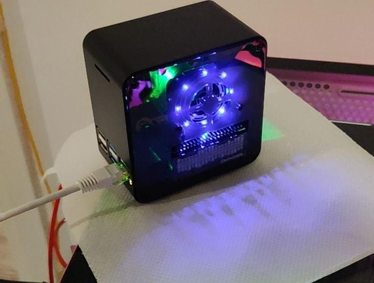

# ProjectPP
Meta repository for projects running on PP. The motivation is to archieve and properly document old personal projects on PP for records. In this way it is easier to summary and recognize my previous works on these projects. Most improtantly, it makes easier for potential future deployment by keeping tracks of the file version. Some of the submodules are also open to public for others' interests.   

## Who is PP?

PP refers to Pipi, the name of my Raspberry Pi 4B, running LNMP(Debian) stack.
## Submodules
- [SRRFtransceiver](https://github.com/auda-cz/SRRFtransceiver)
- [Dashboard](https://github.com/auda-cz/Dashboard)
- [TempMon](https://github.com/auda-cz/TempMon)
- [SHTC3interface](https://github.com/auda-cz/SHTC3x-pigpio)
- [WebControl](https://github.com/auda-cz/WebControl)
- [SpeedTest](https://github.com/auda-cz/SpeedTest)
- [WireConnect](https://github.com/auda-cz/WireConnet/)
- [KeepConnectionOpen](https://github.com/auda-cz/KeepConnectionOpen/)
- *Memo-scripts for later*
    - ipptables
    - DDNS
    - vlmcsd
    - certbot

## License
This project is released under GNU GPL-3.